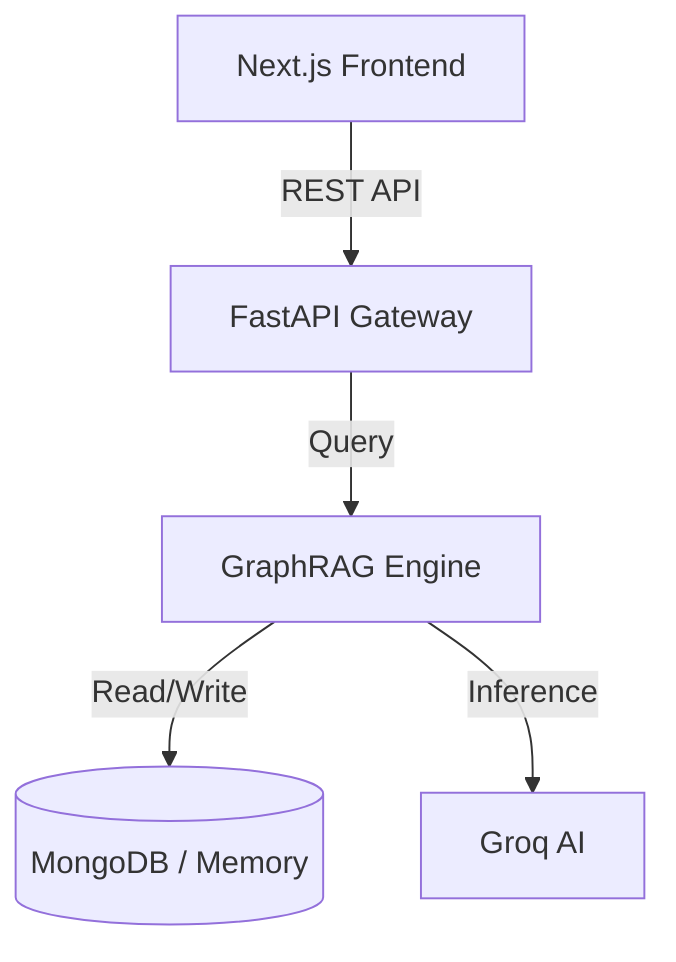

# SkillSync

<div align="center">
  <h3>AI-Powered Peer Learning Network</h3>
  <p>Connect with the right mentor, master any skill. Powered by GraphRAG.</p>
  
  [](https://nextjs.org)
  [](https://fastapi.tiangolo.com)
  [](https://github.com/microsoft/graphrag)
  [](LICENSE)
</div>

---

## 🚀 Overview

**SkillSync** connects students based on their **actual skills**, not just their courses. It uses a **GraphRAG (Retrieval-Augmented Generation)** engine to map the campus knowledge graph, enabling intelligent matching based on proficiency, year gap, and mutual exchange opportunities.

**Built for FORTEX36 Hackathon at SRM AP.**

### ✨ Key Features

*   **🧠 Intelligent Matching:** Finds mentors based on proficiency, seniority, and branch.
*   **🤝 Mutual Exchange:** Identifies "I teach you X, you teach me Y" opportunities.
*   **🎨 Premium UI/UX:** "Tech-Brutalist Luxury" design with scroll animations and micro-interactions.
*   **⚡ Real-time Graph:** Live visualization of the campus skill network.
*   **📱 Mobile First:** Fully responsive design for students on the go.

---

## 🛠️ Tech Stack

| Layer | Technology |
|-------|------------|
| **Frontend** | Next.js 14, TypeScript, Tailwind CSS v4, Framer Motion |
| **Backend** | Python, FastAPI, NetworkX (Graph Engine) |
| **Data** | MongoDB (Production), In-Memory Graph (Demo) |
| **AI/ML** | Custom GraphRAG Algorithm, Groq (Llama 3) |
| **DevOps** | Docker, PowerShell Automation |

---

## 🏁 Quick Start (Demo Mode)

We provide a unified startup script for Windows.

1.  **Clone the repository:**
    ```bash
    git clone https://github.com/aryanraokulkarni03-a11y/fortex36.git
    cd skillsync
    ```

2.  **Run the startup script:**
    ```powershell
    .\scripts\start-dev.ps1
    ```

    This command will:
    *   Start the Python Backend (Port 8000)
    *   Start the Next.js Frontend (Port 3000)
    *   Automatically seed demo data 

3.  **Open the App:**
    *   **Frontend:** [http://localhost:3000](http://localhost:3000)
    *   **API Docs:** [http://localhost:8000/docs](http://localhost:8000/docs)

---

## 📖 Documentation

*   [**Setup Guide**](docs/SETUP.md) - Detailed installation instructions.
*   [**Demo Script**](docs/DEMO_SCRIPT.md) - Step-by-step walkthrough for presenters.
*   [**API Documentation**](http://localhost:8000/redoc) - Backend API reference.

---

## 🏗️ Architecture



---

## ❤️ Team On-Sight

Made with caffeine and code for SRM AP students.
